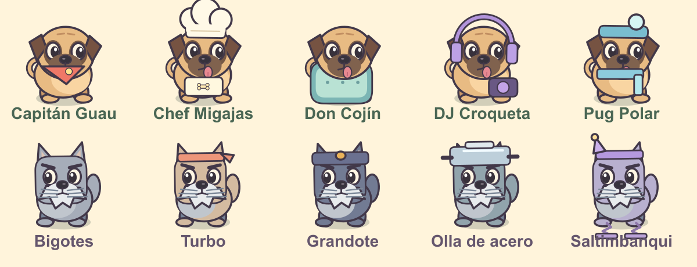

# PUGS vs. SCHNAUZERS

**La batalla del jardín.** Un patio, cinco Pugs y demasiados bigotes. Juego original de defensa por carriles, diseñado para iPhone en horizontal. Un nivel con nueve oleadas y un jefe final. Interfaz en español, arte vectorial original animado y efectos de sonido sintetizados.



## Estado de entrega

El proyecto está implementado y comprobado mediante **23 pruebas automatizadas**, incluyendo simulación de partidas completas y eventos de la interfaz con un DOM simulado. Está preparado en la rama local `main`.

**No está publicado en GitHub ni desplegado en una URL pública.** El conector permitió leer el repositorio vacío `karloss-1/Pugs-vs-schnauzers`, pero rechazó la primera escritura porque requería una aprobación que el entorno no permitía solicitar. También se intentó publicar directamente en `main` por instrucción del usuario y la escritura volvió a ser rechazada. No se modificó el repositorio remoto.

La revisión visual disponible corresponde al arte original renderizado desde sus formas vectoriales; no es una captura del juego ejecutándose en Safari. La instalación, el rendimiento real, la interfaz en distintos tamaños y la caché offline real requieren validación posterior en navegador y iPhone. Ver [QA](docs/QA.md).

## Ejecutar

No hay dependencias de producción ni proceso de compilación.

**Vista local rápida en una computadora:** abre `play.html` en un navegador que permita JavaScript en archivos locales. Es una versión generada con scripts, estilos e iconos integrados. Esta modalidad no instala la PWA.

**Modo PWA / desarrollo:** desde la raíz:

```sh
python3 -m http.server 8000
```

Abre `http://localhost:8000`. Para instalar y guardar la PWA en un iPhone, sirve la carpeta completa por **HTTPS**. Una dirección HTTP de una computadora en la red local no habilita el service worker en el iPhone.

## Publicar en el repositorio solicitado

El checkout local ya contiene una rama y un commit. Con conexión y permisos normales de GitHub:

```sh
git push -u origin main
```

El repositorio remoto estaba completamente vacío al inspeccionarlo. Esta primera subida puede crear directamente la rama del juego. No requiere crear una rama de desarrollo ni hacer un merge.

Para obtener una URL de juego, en **Settings → Pages**, selecciona **Deploy from a branch**, la rama `main` y la carpeta raíz `/`. GitHub Pages sirve los archivos estáticos; no se necesita una build. Alternativamente, se puede servir la misma carpeta en cualquier hosting estático HTTPS. La URL final depende de la configuración que se active y no se ha verificado en esta entrega.

## Instalar en iPhone

1. Abre la URL HTTPS publicada en Safari.
2. Espera a que la pantalla inicial termine de cargar. En «Instalar en iPhone», el mensaje «Jardín listo» confirma que el service worker controla esta carga.
3. Toca **Compartir → Agregar a inicio**; según la versión de iOS, activa «Abrir como app web» si aparece esa opción.
4. Abre el icono de la pantalla de inicio y gira el iPhone a horizontal.
5. Prueba una segunda apertura sin conexión después de completar la primera carga online.

El manifest solicita horizontal, pero no se depende de que iOS bloquee la orientación: una pantalla propia solicita girar el dispositivo. Se aplica `viewport-fit=cover` y padding con las cuatro safe areas. El avance se detiene cuando la página queda oculta o pasa a vertical; al regresar se requiere reanudar explícitamente.

## Controles y reglas

- Toca una tarjeta de Pug y después una casilla iluminada. Puedes colocar varios Pugs del mismo tipo una vez que termine su cooldown.
- Toca los premios dorados para recogerlos. Se recogen automáticamente después de 9 segundos para reducir la carga táctil.
- «Retirar» devuelve la mitad del coste original de un Pug, redondeada hacia abajo.
- Pausa detiene el motor y suspende el audio. El botón de ayuda también detiene una partida activa.
- Tres Schnauzers que atraviesen el extremo izquierdo causan derrota. Si el jefe llega a ese extremo, pierdes inmediatamente.
- Victoria: derrota al Barón y elimina los enemigos restantes.
- Ratón funciona con la misma interacción. Opcionalmente, las teclas 1–5 seleccionan Pugs y Escape pausa o reanuda.

El tutorial exige colocar primero un Chef y después un Capitán. Antes de ambos pasos no empieza el reloj de invasión y no permite gastar premios en otras unidades, evitando que el jugador quede sin recursos durante el tutorial.

## Los cinco Pugs

| Pug | Personalidad y silueta | Coste | Cooldown | Vida | Habilidad |
| --- | --- | ---: | ---: | ---: | --- |
| Capitán Guau | Entusiasta, pañuelo coral | 100 | 5 s | 190 | Ladrido-proyectil: 24 de daño cada 1.35 s |
| Chef Migajas | Generoso, gorro y delantal | 75 | 6 s | 150 | Primer premio a los 7 s; luego 25 cada 12 s |
| Don Cojín | Tranquilo, armadura de almohada | 125 | 12 s | 850 | Bloqueo sin ataque; absorbe mordidas |
| DJ Croqueta | Dramático, audífonos y bocina | 200 | 10 s | 185 | 42 de daño cada 2.8 s a enemigos a 105 unidades del impacto en su carril |
| Pug Polar | Sereno, gorro y bufanda azul | 150 | 8 s | 180 | 12 de daño cada 1.9 s; ralentiza 50% por 4 s |

Cada rig tiene respiración, movimientos de orejas y cola, anticipación/recuperación de la habilidad, deformación de ataque, destello al recibir daño y salida con partículas. Chef celebra su producción y DJ dispara discos. Don Cojín expresa su función con una gran almohada y no simula un ataque inexistente.

## Los cinco Schnauzers

| Schnauzer | Silueta | Vida / armadura | Velocidad | Comportamiento |
| --- | --- | ---: | ---: | --- |
| Bigotes | Gris clásico | 145 | 11 | Avance normal y mordidas de 18 por segundo |
| Turbo | Banda deportiva coral | 95 | 27 | Muy rápido y frágil; mordidas de 15 |
| Grandote | Cuerpo grande, banda y placa | 480 | 7 | Lento y resistente; mordidas de 25 |
| Olla de acero | Olla plateada en la cabeza | 175 + 155 | 10 | La armadura absorbe golpes antes que la vida; mordidas de 20 |
| Saltimbanqui | Gorro violeta y resortes | 145 | 14 | Salta exactamente una unidad y luego combate; mordidas de 18 |

Las velocidades se expresan en unidades del mundo por segundo. El salto tiene un contrapeso fácil de comprender: colocar una segunda unidad detrás. Los enemigos mueven sus patas mientras caminan, reaccionan a golpes y dejan premios al retirarse.

## El Barón von Bigotes

Entra en la novena oleada con corona, monóculo, capa, anuncio propio y barra global de vida. Tiene **2600 de vida** y avanza lentamente.

- **Ladrido de carril:** empieza a anunciarlo a los 7 segundos de su entrada. Espera 2.5 segundos y hace 28 de daño a los Pugs de esa fila. Después lo prepara cada 15 segundos.
- **Cambio de carril:** prepara un cambio cada 24 segundos, con tres segundos de aviso en la fila de destino. Recorre las filas con un patrón fijo.
- **Invocación:** llama un Bigotes después de 18 segundos y luego cada 25 segundos; en la segunda fase invoca Turbo.
- **Segunda fase:** se activa bajo 50% de vida. Aumenta 25% su velocidad y cambia sus refuerzos.
- **Ventana táctica:** durante la preparación de una habilidad se detiene y recibe 25% más daño.

Las habilidades se preparan una por una para evitar avisos simultáneos. La derrota del jefe dispara una explosión de partículas, sacudida breve y recompensa; la victoria espera a que se eliminen sus refuerzos.

## Balance

Las oleadas empiezan a los segundos 28, 58, 90, 126, 165, 202, 242, 285 y 330. Introducen enemigos gradualmente. El jugador empieza con 350 premios, recibe 25 cada 10 segundos y puede aumentar la economía con Chefs. Los enemigos derrotados dejan 10 premios.

Se probaron tres estrategias en cinco semillas: defensa equilibrada, reacción más lenta con menos Chefs y pasividad. Las dos primeras ganan alrededor de **6:15**, con 64 enemigos derrotados y el jefe eliminado. La pasiva pierde alrededor de **2:26**. Son simulaciones automatizadas de decisiones, **no sesiones de usuarios reales** ni evidencia de una tasa de victoria humana. Las semillas varían posiciones de premios y partículas; las oleadas mantienen el mismo patrón deliberadamente legible.

Los costes y habilidades permiten construir una defensa fuerte antes del jefe. La penalización por una fila olvidada no termina de inmediato la partida. El balance busca una primera victoria posible y todavía necesita una ronda de playtesting humano para confirmar que la tensión y el ritmo resultan divertidos.

## Arquitectura

| Archivo | Responsabilidad |
| --- | --- |
| `src/config.js` | Definiciones de entidades, economía, tablero y calendario de oleadas |
| `src/engine.js` | Estado, daño, proyectiles, bloqueos, recursos, jefe y condiciones de final |
| `src/renderer.js` | Rigs originales, escenario, animaciones y partículas; Canvas 2D |
| `src/app.js` | Controles táctiles, interfaz, tutorial y ciclo de vida |
| `src/audio.js` | Síntesis Web Audio inicializada desde una interacción del usuario |
| `sw.js` | Precaché atómico de los archivos esenciales, shell offline y limpieza de versiones anteriores |
| `manifest.webmanifest` | Identidad, iconos, alcance y modo standalone de la PWA |
| `tools/build-standalone.mjs` | Genera `play.html` para abrir el juego en una computadora sin servidor |
| `tests/` | Pruebas del motor, simulaciones y eventos de interfaz con DOM simulado |

El escenario se prerenderiza una sola vez. El DPR está limitado a 2, el delta a 50 ms, las partículas a 100 y los enemigos simultáneos a 32. La invasión usa el tiempo del motor, nunca `setInterval`, por lo que no acumula oleadas al regresar de segundo plano. No hay imágenes descargadas, samples de audio ni fuentes remotas.

El terreno, personajes y efectos se dibujan desde vectores en `renderer.js`; los iconos PNG se incluyen con su fuente SVG original en `assets/icons/`. Las imágenes de `docs/` ilustran el arte y no son dependencias de ejecución. El juego no utiliza analítica ni peticiones a terceros. Solo se conserva localmente la preferencia de sonido.

## Comprobaciones

Con Node 22 o posterior:

```sh
npm test
npm run balance
node tools/build-standalone.mjs
```

La automatización de GitHub incluida ejecuta las mismas comprobaciones al subir la rama del juego. No instala librerías de producción. Ver [QA](docs/QA.md) para distinguir lo verificado de lo pendiente.
